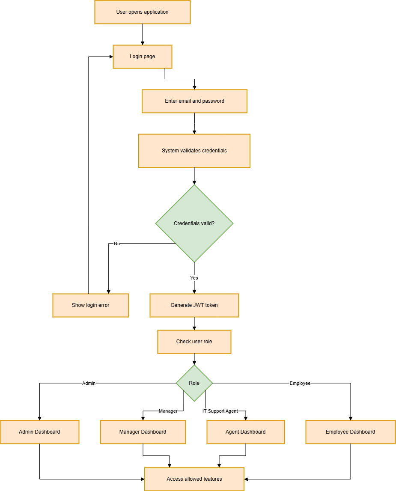
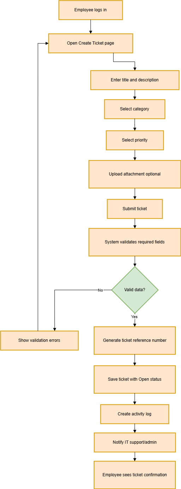
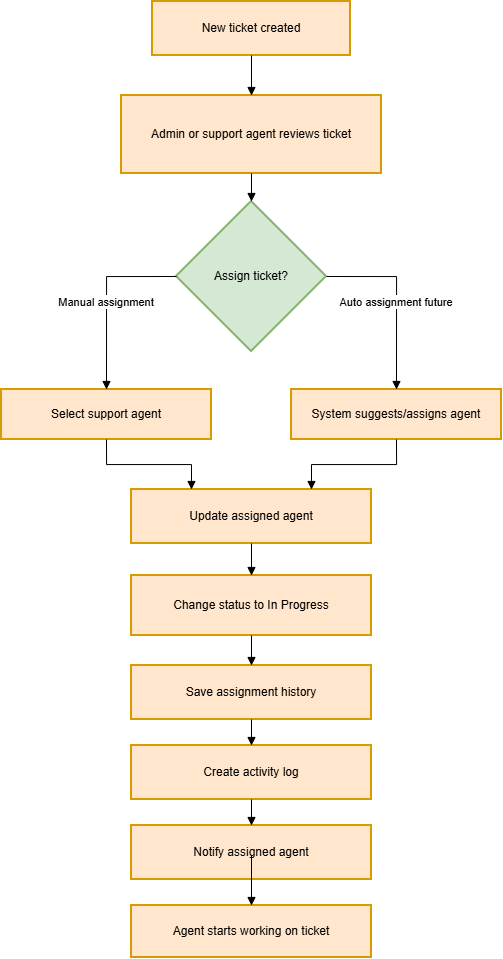
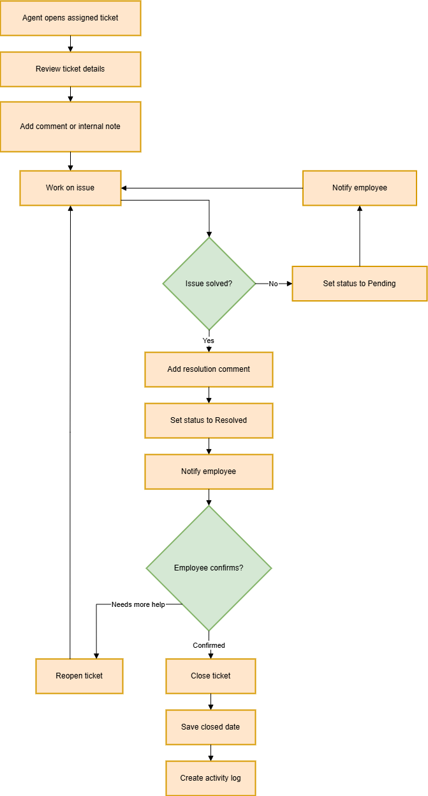
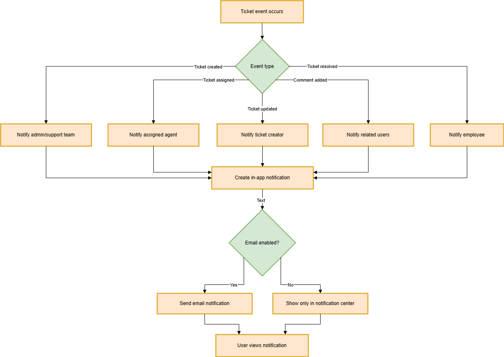

# System Workflows

## TicketFlow

This document presents the main system workflows for TicketFlow. These workflows explain how users interact with the application during authentication, ticket creation, ticket assignment, ticket resolution, and notifications.

---

## 1. Authentication Workflow

### Description

This workflow shows how a user logs into the system and is redirected based on their role. The system validates the user's credentials, generates a secure token, checks the user's role, and allows access to the correct dashboard.

### Diagram

### Main Steps

1. The user opens the application.
2. The user enters their email and password.
3. The system validates the login credentials.
4. If the credentials are invalid, the system displays an error message.
5. If the credentials are valid, the system generates an authentication token.
6. The system checks the user's role.
7. The user is redirected to the correct dashboard based on their role.

---

## 2. Ticket Creation Workflow

### Description

This workflow shows how an employee creates a new support ticket. The employee enters the required ticket information, optionally uploads an attachment, and submits the ticket. The system validates the information, creates the ticket, and notifies the support team.

### Diagram

### Main Steps

1. The employee logs into the system.
2. The employee opens the Create Ticket page.
3. The employee enters the ticket title and description.
4. The employee selects a category and priority.
5. The employee optionally uploads an attachment.
6. The employee submits the ticket.
7. The system validates the required fields.
8. The system generates a ticket reference number.
9. The ticket is saved with an Open status.
10. The system creates an activity log.
11. The IT support team or admin is notified.

---

## 3. Ticket Assignment Workflow

### Description

This workflow shows how a ticket is assigned to an IT support agent. An admin or authorized support agent reviews the ticket, selects an agent, updates the ticket status, records the assignment history, and notifies the assigned agent.

### Diagram

### Main Steps

1. A new ticket is created.
2. An admin or support agent reviews the ticket.
3. The ticket is assigned to a support agent.
4. The assigned agent is saved in the system.
5. The ticket status is updated to In Progress.
6. The system records the assignment history.
7. The system creates an activity log.
8. The assigned support agent receives a notification.
9. The agent starts working on the ticket.

---

## 4. Ticket Resolution and Closure Workflow

### Description

This workflow shows how an assigned agent handles a ticket until it is resolved or closed. The agent reviews the ticket, communicates with the employee, updates the status, and closes the ticket when the issue is solved.

### Diagram

### Main Steps

1. The assigned agent opens the ticket.
2. The agent reviews the ticket details.
3. The agent adds a comment or internal note.
4. The agent works on the issue.
5. If the issue is not solved, the ticket may be set to Pending.
6. If the issue is solved, the agent adds a resolution comment.
7. The ticket status is updated to Resolved.
8. The employee is notified.
9. If the employee still needs help, the ticket can be reopened.
10. If the employee confirms the solution, the ticket is closed.
11. The system records the closed date and creates an activity log.

---

## 5. Notification Workflow

### Description

This workflow shows how notifications are created and delivered when important ticket events happen. Notifications may be shown inside the application and may also be sent by email if email notifications are enabled.

### Diagram

### Main Steps

1. A ticket-related event occurs.
2. The system identifies the event type.
3. The system creates an in-app notification.
4. The related user receives the notification.
5. If email notifications are enabled, the system sends an email notification.
6. The user views the notification from the notification center.
